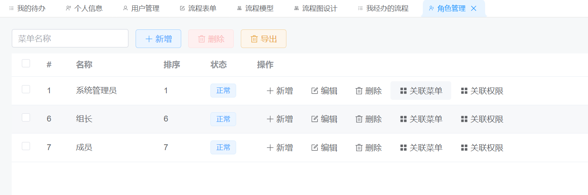
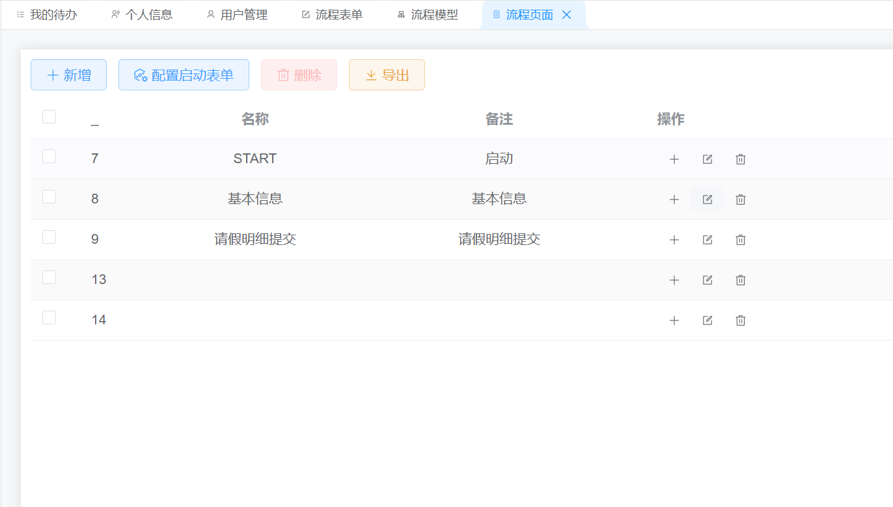
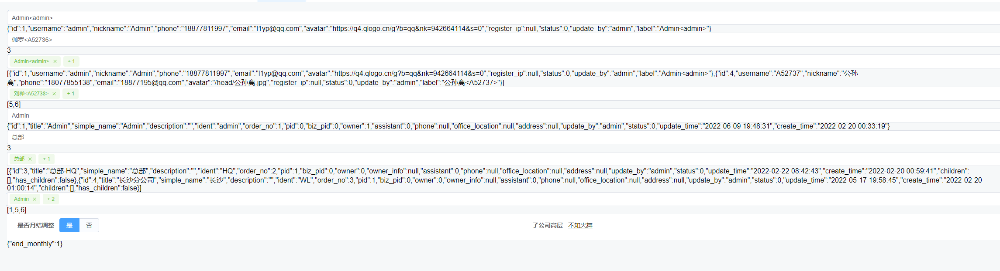

# Van
## 项目介绍
[Van](https://admin.l1yp.com/) 是一个工作流和低代码的前端解决方案，基于 [Vue3](https://staging-cn.vuejs.org/guide/introduction.html) 和 [Element-Plus](https://element-plus.org/zh-CN/guide/design.html) 实现。

[Van](https://admin.l1yp.com/) 使用了目前最新的技术体系，内置了动态路由，菜单管理，用户管理，组织机构等基础功能，状态管理采用 Vue3 的 [Provide / Inject](https://staging-cn.vuejs.org/guide/components/provide-inject.html#provide)，组件通信基于 MITT。

实现了各种非常好用的基础组件：[用户选择器](https://admin.l1yp.com/user/profile)，部门选择器，字典输入/输出组件。

[工作流设计器](https://admin.l1yp.com/process/app/design/2?processKey=holiday) 基于 [bpmn-js 9.0.3](https://github.com/bpmn-io/bpmn-js) 实现。

[在线表单](https://admin.l1yp.com/process/model/form) 基于 [Vuedraggable.next](https://github.com/SortableJS/vue.draggable.next) 实现，支持拖拉拽生成JSON并在线预览。

代码预览采用 [CodeMirror6](https://codemirror.net/) 实现。

- [👀在线预览](https://admin.l1yp.com/)
- ✈使用教程：正在筹备
- 

# Features
- [x] 拖拽控件生成表单，流程页面绑定在线表单
- [x] 支持父子表关联，动态新增多条与流程关联的单据
- [x] 支持子流程，采用CallActivity实现
- [x] 表达式(条件)可视化编辑
- [x] 流程视图可视化配置
- [x] 流程支持附件/备注


## 起步

```sh
npm install -g pnpm # 安装pnpm
pnpm install # 安装依赖
```

### 开发

```sh
npm run dev
```

### 编译

```sh
npm run build
```

# 演示地址
接口部署在本地，可能偶尔会掉线：https://admin.l1yp.com/
发现掉线可以加群联系我：[770709473](https://jq.qq.com/?_wv=1027&k=hyd5LqDR)


# 功能截图

| 模块  | 功能       | 截图                                               |
|-----|----------|--------------------------------------------------|
| 系统  | 用户管理     |              |
| 系统  | 角色管理     |              |
| 系统  | 菜单管理     |              |
| 系统  | 部门管理     |              |
| 系统  | 字典管理     |              |
| 流程  | 流程模型     |       |
| 流程  | 流程字段     |       |
| 流程  | 流程表单     |    |
| 流程  | 表单配置     |    |
| 流程  | 流程视图(实例) |  |
| 流程  | 流程设计器    |        |
| 流程  | 流程详情     |             |
| 流程  | 流程历史     |          |
| 流程  | 在线表单     |              |


# 组件

> 样例
```vue
<user-selector-input
  style="width: 100%"
  v-model="selectedElem"
  :multiple="false"
  placeholder="单选用户，value是对象，可双击弹框选择"
>
</user-selector-input>
<div>
  {{ JSON.stringify(selectedElem) }}
</div>


<user-selector-input
  style="width: 100%"
  v-model="selectedUserId"
  value-key="id"
  :multiple="false"
  placeholder="单选用户，value是id，可双击弹框选择"
>
</user-selector-input>
<div>
  {{ selectedUserId }}
</div>
<user-selector-input
  style="width: 100%"
  v-model="selectedElems"
  multiple
  placeholder="多选用户，value是对象数组，可双击弹框选择"
>
</user-selector-input>
<div>
  {{ JSON.stringify(selectedElems) }}
</div>

<user-selector-input
  style="width: 100%"
  v-model="selectedUserIds"
  value-key="id"
  multiple
  placeholder="多选用户，value是ID数组，可双击弹框选择"
>
</user-selector-input>
<div>
  {{ JSON.stringify(selectedUserIds) }}
</div>


<dept-selector-input
  style="width: 100%"
  v-model="selectedDeptElem"
  :multiple="false"
  placeholder="单选部门，value是对象，可双击弹框选择"
>
</dept-selector-input>
<div>
  {{ JSON.stringify(selectedDeptElem) }}
</div>

<dept-selector-input
  style="width: 100%"
  v-model="selectedDeptId"
  value-key="id"
  :multiple="false"
  placeholder="单选部门，value是ID，可双击弹框选择"
>
</dept-selector-input>
<div>
  {{ selectedDeptId }}
</div>

<dept-selector-input
  style="width: 100%"
  v-model="selectedDeptElems" multiple
  placeholder="多选部门，value是对象数组，可双击弹框选择"
>
</dept-selector-input>
<div>
  {{ JSON.stringify(selectedDeptElems) }}
</div>

<dept-selector-input
  style="width: 100%"
  v-model="selectedDeptIds"
  value-key="id" multiple
  placeholder="多选部门，value是ID数组，可双击弹框选择"
>
</dept-selector-input>
<div>
  {{ JSON.stringify(selectedDeptIds) }}
</div>

<v-form-pro
  :form-attr="{labelWidth: '120px'}"
  :scheme="formScheme"
  v-model="formModel"
>

</v-form-pro>
<div>
  {{ JSON.stringify(formModel) }}
</div>
```




## 字典组件
### DictTag 字典值展示组件
#### 示例
```vue
<dict-tag ident="publish" :val="scope.row.state" ></dict-tag>
```
#### 参数
```ts
interface DictTagProps {
  multiple: boolean // 是否多选
  scope: string // 字典范围
  ident: string // 字典标识
  val: number | DictValue | number[] | DictValue[] // 字典值
  valType: 'id' | 'value' | 'raw' // 字典值类型
}
```
#### 样式


### DictInput 字典输入组件
#### 示例
```vue
<dict-input ident="dict_type" v-model="type"></dict-input>
```
#### 参数
```ts
interface DictInputProps {
  multiple: boolean // 是否多选
  scope: string // 字典范围
  ident: string // 字典标识
  checkStrictly: boolean // 树形字典是否父子级联
  modelValue: number | number[] // 字典值
  valType: 'id' | 'value' | 'raw' // 字典值类型
  placeholder: string // 空提示文本
}
```

#### 样式


### SVGIcon组件

#### 示例
```vue
<SVGIcon name="logo" width="30px" height="30px" color="red" bg-color="#FFFFFFFF"></SVGIcon>
```

#### 参数
```ts
interface SVGIconProps {
  name: string // svg文件名
}
```

### DeptSelectorInput部门选择器组件
#### 示例
```vue
  <dept-selector-input v-model="selectedDeptElems" multiple></dept-selector-input>
```

#### 参数
```ts
interface DeptSelectorInputProps {
  multiple?: boolean // 是否多选
  modelValue: number | number[] | string | string[] | DeptView | DeptView[] | null
  valueKey?: string
  readViewFn?: (param: number | number[] | string | string[]) => DeptView
}
```
#### 演示截图


### UserSelectorInput用户选择器组件
#### 示例
```vue
  <user-selector-input style="width: 100%" v-model="selectedElems" multiple></user-selector-input>
```

#### 参数
```ts
interface UserSelectorInputProps {
  multiple?: boolean
  modelValue: number | number[] | string | string[] | UserView | UserView[] | null
  valueKey?: string
  readViewFn?: (param: number | number[] | string | string[]) => UserView
}
```


#### 演示截图


### VDialog 弹框组件

#### 示例
```vue
<v-dialog
    v-model="visible"
    :title="props.title"
    @confirm="confirmDeptDialog"
    @cancel="emits('cancel')"
></v-dialog>
```

#### 参数
```ts
interface VDialogProps {
  modelValue: boolean
  title: string
  width: string | number // 默认50%
  top: string | number // 默认15vh
  modal: boolean // true
  appendToBody: boolean // false
  lockScroll: boolean // true
  customClass: string // true
  openDelay: number
  closeDelay: number
  closeOnClickModal: boolean
  closeOnPressEscape: boolean
  beforeClose: Function
  draggable: boolean
  center: boolean
  destroyOnClose: boolean
  fullScreen: boolean
  showFullScreen: boolean
}
```

#### 事件
> 内置confirm/cancel事件

### VFormPro 表单配置化组件

#### 示例
```vue
  <v-form-pro
    :form-attr="{labelWidth: '120px'}"
    :scheme="formScheme"
    v-model="formModel"
  >
  </v-form-pro>
```

#### 参数定义
```ts
// 参数定义
interface VFormProps {
    formAttr: ElFormProps,
    scheme: FormScheme[][],
    modelValue: Record<string, any>
}

interface ElFormProps extends Record<string, any> {

}

interface FormScheme {
    name: string // map to modelValue
    label: string // 标签名
    component: string // 组件名
    span: number // 宽度
    writeable: boolean // 是否可写(若为true则value会出现在modelValue中)
    formItemAttrs?: Record<string, any> // formItem的自定义属性
    componentAttrs?: Record<string, any> // 组件的自定义属性
}
```

# 流程引擎

## 模型
> 每个流程模型拥有多个bpmn版本，每个流程模型只允许发布一个版本，默认使用已发布的bpmn版本发起流程。


## 字段
> 流程模型需要定义字段类型(用于配置 **页面**/**审核人**)


## 页面
> 通过字段配置流程页面


## 流程设计器
> 支持的节点列表：用户任务/开始/结束/网关

### 约定
如下图，流程走到当前节点，**审核者**可选择**提交**或**驳回**，内部采用瞬时变量控制条件流转。
 