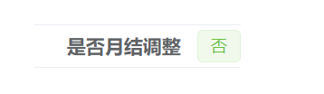
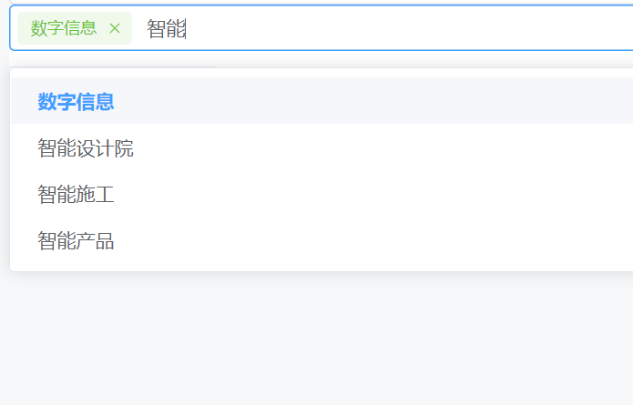
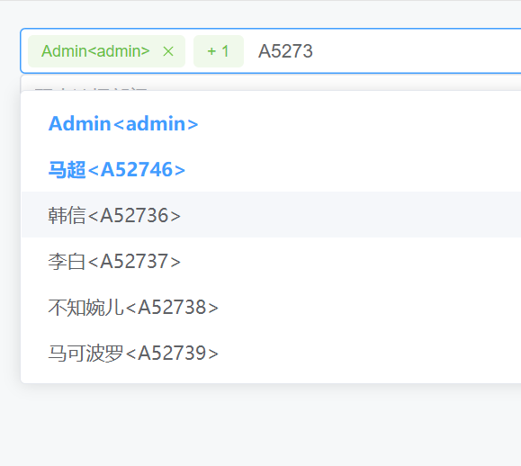
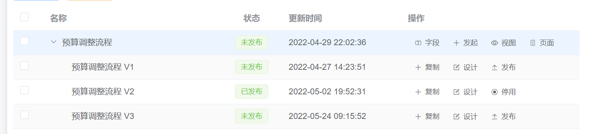
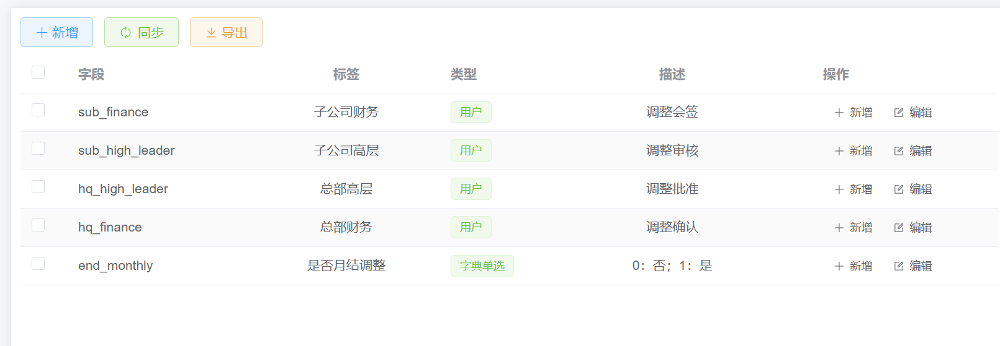
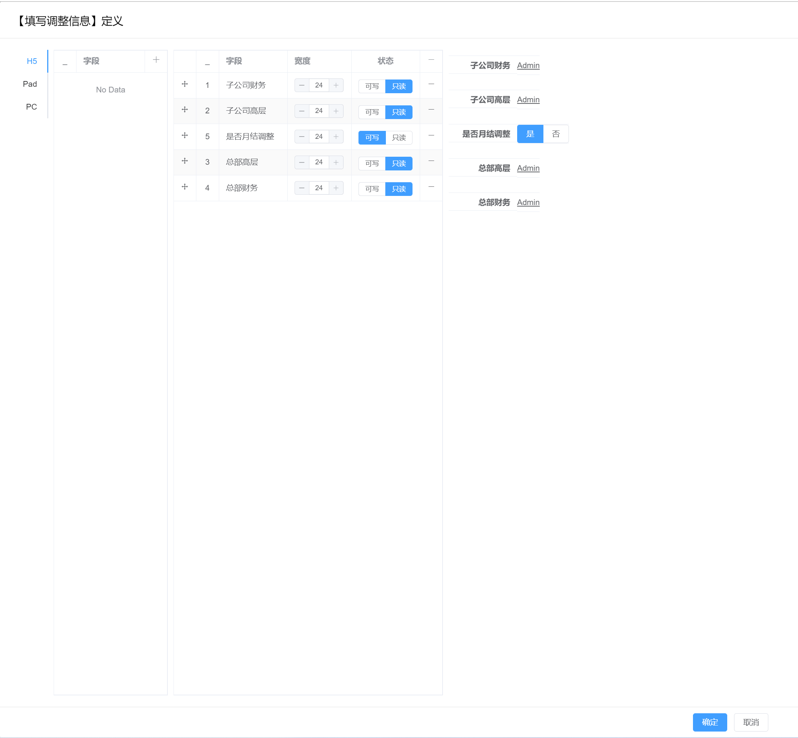
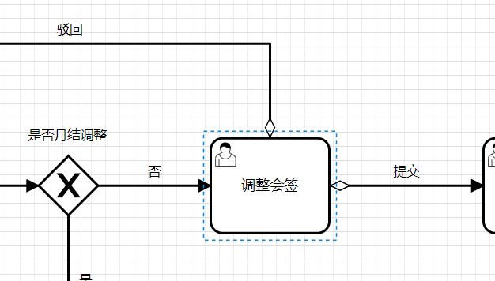

# Van
## 项目介绍
用于学习前端技术的demo项目

## Project Setup

```sh
npm install
```

### Compile and Hot-Reload for Development

```sh
npm run dev
```

### Compile and Minify for Production

```sh
npm run build
```

# 演示地址
接口部署在本地，可能偶尔会掉线：https://admin.l1yp.com/

发现掉线可以加群联系我：[770709473](https://jq.qq.com/?_wv=1027&k=hyd5LqDR)

# 组件
## 字典组件
### DictTag 字典值展示组件
#### 示例
```vue
<dict-tag ident="publish" :val="scope.row.state" ></dict-tag>
```
#### 参数
```ts
interface DictTagProps {
  multiple: boolean // 是否多选
  scope: string // 字典范围
  ident: string // 字典标识
  val: number | DictValue | number[] | DictValue[] // 字典值
  valType: 'id' | 'value' | 'raw' // 字典值类型
}
```
#### 样式



### DictInput 字典输入组件
#### 示例
```vue
<dict-input ident="dict_type" v-model="type"></dict-input>
```
#### 参数
```ts
interface DictInputProps {
  multiple: boolean // 是否多选
  scope: string // 字典范围
  ident: string // 字典标识
  checkStrictly: boolean // 树形字典是否父子级联
  modelValue: number | number[] // 字典值
  valType: 'id' | 'value' | 'raw' // 字典值类型
  placeholder: string // 空提示文本
}
```

#### 样式


### SVGIcon组件

#### 示例
```vue
<SVGIcon name="logo" width="30px" height="30px" color="red" bg-color="#FFFFFFFF"></SVGIcon>
```

#### 参数
```ts
interface SVGIconProps {
  name: string // svg文件名
}
```

### DeptSelectorInput部门选择器组件
#### 示例
```vue
  <dept-selector-input v-model="selectedDeptElems" multiple></dept-selector-input>
```

#### 参数
```ts
interface DeptSelectorInputProps {
  multiple?: boolean // 是否多选
  modelValue: number | number[] | string | string[] | DeptView | DeptView[] | null
  valueKey?: string
  readViewFn?: (param: number | number[] | string | string[]) => DeptView
}
```
#### 演示截图




### UserSelectorInput部门选择器组件
#### 示例
```vue
  <user-selector-input style="width: 100%" v-model="selectedElems" multiple></user-selector-input>
```

#### 参数
```ts
interface UserSelectorInputProps {
  multiple?: boolean
  modelValue: number | number[] | string | string[] | UserView | UserView[] | null
  valueKey?: string
  readViewFn?: (param: number | number[] | string | string[]) => UserView
}
```


#### 演示截图




### VDialog 弹框组件

#### 示例
```vue
<v-dialog
    v-model="visible"
    :title="props.title"
    @confirm="confirmDeptDialog"
    @cancel="emits('cancel')"
></v-dialog>
```

#### 参数
```ts
interface VDialogProps {
  modelValue: boolean
  title: string
  width: string | number // 默认50%
  top: string | number // 默认15vh
  modal: boolean // true
  appendToBody: boolean // false
  lockScroll: boolean // true
  customClass: string // true
  openDelay: number
  closeDelay: number
  closeOnClickModal: boolean
  closeOnPressEscape: boolean
  beforeClose: Function
  draggable: boolean
  center: boolean
  destroyOnClose: boolean
  fullScreen: boolean
  showFullScreen: boolean
}
```

#### 事件
> 内置confirm/cancel事件

### VFormPro 表单配置化组件

#### 示例
```vue
  <v-form-pro
    :form-attr="{labelWidth: '120px'}"
    :scheme="formScheme"
    v-model="formModel"
  >
  </v-form-pro>
```

#### 参数定义
```ts
// 参数定义
interface VFormProps {
    formAttr: ElFormProps,
    scheme: FormScheme[][],
    modelValue: Record<string, any>
}

interface ElFormProps extends Record<string, any> {

}

interface FormScheme {
    name: string // map to modelValue
    label: string // 标签名
    component: string // 组件名
    span: number // 宽度
    writeable: boolean // 是否可写(若为true则value会出现在modelValue中)
    formItemAttrs?: Record<string, any> // formItem的自定义属性
    componentAttrs?: Record<string, any> // 组件的自定义属性
}
```

# 流程引擎

## 模型
> 每个流程模型拥有多个bpmn版本，每个流程模型只允许发布一个版本，默认使用已发布的bpmn版本发起流程。



## 字段
> 流程模型需要定义字段类型(用于配置 **页面**/**审核人**)



## 页面
> 通过字段配置流程页面



## 流程设计器
> 支持的节点列表：用户任务/开始/结束/网关

### 约定
如下图，流程走到当前节点，**审核者**可选择**提交**或**驳回**，内部采用瞬时变量控制条件流转。
 